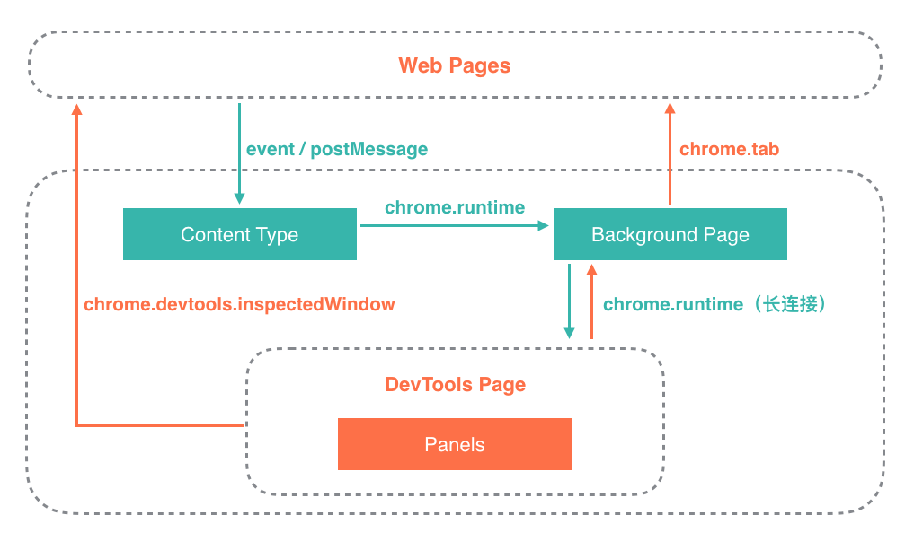

# ec-devtools

ec-devtools是支持canvas库 ( easycanvas , https://github.com/chenzhuo1992/easycanvas ) 的chrome调试工具，能对canvas的元素的样式、物理属性等进行修改，达到所见即所得的效果，提高调试效率，如下：


具体使用，参考 canvas库 [easycanvas](https://github.com/chenzhuo1992/easycanvas)，以下聊聊 **ec-devtools** 的实现

## 实现

### chrome devtools 通信

<p align="left">
    
</p>

* DevTools Page：开发者工具
* Background Page：后台页面
* Content Script：内容脚本

#### 网页与内容脚本通信
内容脚本（Content Script）是在网页的上下文中运行的js文件，可以通过获取DOM和DOM事件。

网页不能直接与开发者工具（DevTools Page）进行通信，需要通过在内容脚本中监听网页事件，通过chrome.runtime API将消息传递到后台页面中，从而传递到开发者工具中。

内容脚本可以监听网页的DOM事件或者window.postMessage事件，如下：

##### web page

``` js
window.postMessage({
    name: 'hello wolrd'
}, '*');
```

##### content-script.js

``` js
window.addEventListener('message', e => {
    if (e.source === window) {
        chrome.runtime.sendMessage(e.data);
    }
});
```

#### 内容脚本与后台页面通信

内容脚本监听的事件触发之后，通过chrome.runtime.sendMessage()方法将消息传递到后台页面（Background Page）中。

后台脚本通过chrome.runtime.onMessage.addListener()方法监听消息，如下：

##### background.js

``` js
chrome.runtime.onMessage.addListener((message, sender, sendResponse) => {
    if (sender.tab) {
        const tabId = sender.tab.id;
        ......
    } else {
        console.log("sender.tab not defined.");
    }
    return true;
});
```

#### 后台页面与开发者工具通信

后台页面与开发者工具通过长连接进行通信。（chrome.runtime API）如下：

##### devtool.js

``` js
// 与后台页面消息通信-长连接
const port = chrome.runtime.connect({name: 'devtools'});
// 监听后台页面消息
port.onMessage.addListener((message) => {
    ......
});
// 往后台页面发送消息
port.postMessage({
    name: 'original',
    tabId: chrome.devtools.inspectedWindow.tabId
});
```

##### background.js

``` js
chrome.runtime.onConnect.addListener(function (port) {
 
    const extensionListener = function (message, sender, sendResponse) {
        if (message.name == 'original') {
            ......
        }
    };
    port.onMessage.addListener(extensionListener);
 
    port.onDisconnect.addListener(function(port) {
        port.onMessage.removeListener(extensionListener);
    });
});
```

#### 内容脚本的消息怎么传递到开发者工具？

通过后台页面作为桥，实现将内容脚本的消息传递到开发者工具中。如下：

##### background.js

``` js
// 作为content script 与 devtool 通信的桥
const connections = {};
 
chrome.runtime.onConnect.addListener(function (port) {
 
    const extensionListener = function (message, sender, sendResponse) {
        if (message.name == 'original') {
            connections[message.tabId] = port;
        }
    };
    port.onMessage.addListener(extensionListener);
 
    port.onDisconnect.addListener(function(port) {
        port.onMessage.removeListener(extensionListener);
 
        const tabs = Object.keys(connections);
        for (let i = 0, len = tabs.length; i < len; i++) {
            if (connections[tabs[i]] == port) {
                delete connections[tabs[i]];
                break;
            }
        }
    });
});
 
// 接收内容脚本的消息，并发送到devtool的消息
chrome.runtime.onMessage.addListener((message, sender, sendResponse) => {
    if (sender.tab) {
        const tabId = sender.tab.id;
        if (tabId in connections) {
            connections[tabId].postMessage(message);
        } else {
            console.log("Tab not found in connection list.");
        }
    } else {
        console.log("sender.tab not defined.");
    }
    return true;
});
```

#### 开发者工具与网页通信

两种方法：

1、直接使用chrome.devtools.inspectedWindow.eval()方法，在网页的上下文中执行js代码，如下：

##### devtool.js

``` js
chrome.devtools.inspectedWindow.eval('console.log(window)');
```

##### background.js

``` js
chrome.tab.excuteScript(tabId, {
    code: 'console.log(window)'
});
```

以上就是开发 **ec-devtools** chrome开发者工具所使用到的通信方式~